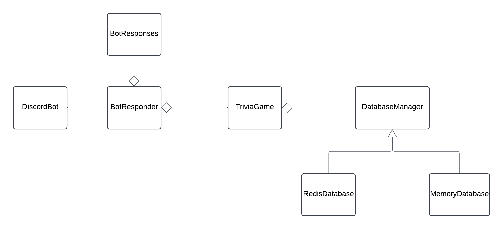

## Project Description

`Nba Trivia Bot is a program that asks users various questions about the NBA. 
In this program, the discord bot will take user commands to start a game, game status, users in game, and end game.
The bot will then use the core application to gather scores for each user and display the winner at the end of the game.`

## System Diagram

`For my database i have a interface that will be implemented by a redisdatabase or a inmemorydatabase. 
These databases will store questions, answers, choices, players and scores and also checks if a user answer matches a correct answer.
My trivia class is my core application which contains start game, in progress, reset,adding score,adding a player, and handling a answer.
My botresponder has a trivia game and uses trivia class to start a game, check status, add player and end game.
My bot responses will provide the user with prompts and responses to the commands they input and will be used in botresponder for exception handling.
Finally, my discord bot will then take the user input and send it to the botresponder to get the response and send it back to the user.`

## Usage

`User Commands:`

`!start - start a new trivia game.` 

`!join - executed by any user who wants to join the game.`

`!go - used to move the game from STARTING to IN_PROGRESS.`

`!status - get the status of the game.`

`!info - get information about the game.`

`!quit - places the game in the NO_GAME state `

`!help - list the commands of the game.`

